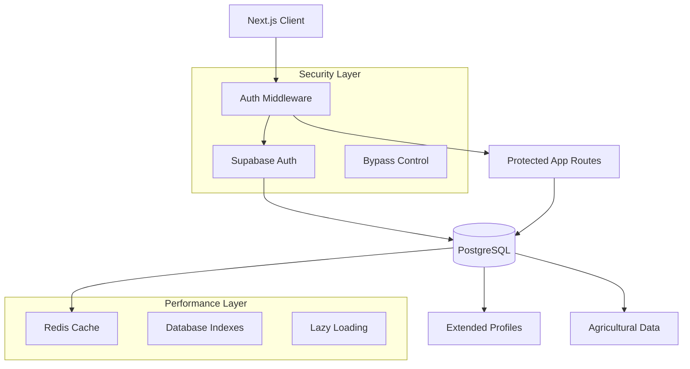
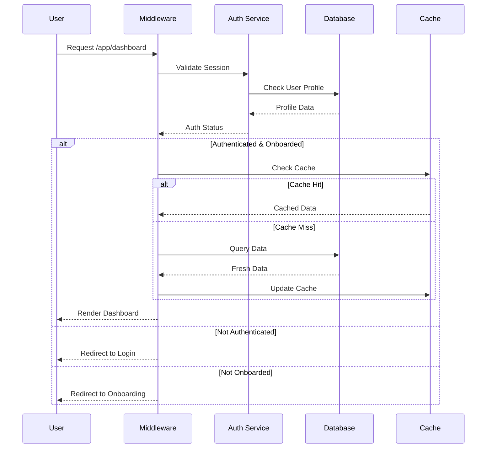

# Design Document

## Overview

This design document outlines the comprehensive authentication and security improvements for OrtoMio AI, addressing critical security gaps while maintaining the system's sophisticated agricultural functionality. The solution implements production-ready authentication flows, extended user profiles, database optimizations, and performance enhancements using modern Next.js 14 and Supabase patterns.

## Architecture

### High-Level Architecture



### Authentication Flow



## Components and Interfaces

### 1. Authentication Service

#### Enhanced Registration Interface
```typescript
interface RegistrationData {
  // Authentication credentials
  email: string;
  password: string;
  
  // Required profile data
  firstName: string;
  lastName: string;
  
  // Optional profile data
  phone?: string;
  birthDate?: Date;
  company?: string;
  
  // Consent and compliance
  termsAccepted: boolean;
  privacyAccepted: boolean;
  marketingConsent: boolean;
}

interface RegistrationResponse {
  success: boolean;
  user?: User;
  profile?: UserProfile;
  error?: AuthError;
  requiresEmailVerification: boolean;
}
```

#### Password Recovery Interface
```typescript
interface PasswordResetRequest {
  email: string;
}

interface PasswordResetConfirm {
  token: string;
  newPassword: string;
  confirmPassword: string;
}

interface PasswordResetResponse {
  success: boolean;
  message: string;
  error?: AuthError;
}
```

### 2. Security Bypass Control

#### Production Security Interface
```typescript
interface SecurityConfig {
  environment: 'development' | 'staging' | 'production';
  bypassEnabled: boolean;
  securityLevel: 'strict' | 'moderate' | 'development';
}

class SecurityBypassController {
  private static instance: SecurityBypassController;
  
  public isBypassActive(): boolean {
    // Triple-check security for production
    if (process.env.NODE_ENV === 'production') return false;
    if (process.env.VERCEL_ENV === 'production') return false;
    
    const isLocalhost = this.isLocalhostEnvironment();
    const hasExplicitFlag = process.env.NEXT_PUBLIC_BYPASS_AUTH === 'true';
    const hasDevFlag = process.env.NEXT_PUBLIC_DEV_MODE === 'true';
    
    return isLocalhost && hasExplicitFlag && hasDevFlag;
  }
  
  private isLocalhostEnvironment(): boolean {
    if (typeof window === 'undefined') return false;
    
    return window.location.hostname === 'localhost' || 
           window.location.hostname === '127.0.0.1' ||
           window.location.hostname.endsWith('.local');
  }
  
  public validateProductionSecurity(): SecurityValidation {
    return {
      bypassDisabled: !this.isBypassActive(),
      environmentSecure: process.env.NODE_ENV === 'production',
      configurationValid: this.validateConfiguration(),
      timestamp: new Date().toISOString()
    };
  }
}
```

### 3. Middleware Implementation

#### Route Protection Middleware
```typescript
// middleware.ts
import { NextResponse } from 'next/server';
import type { NextRequest } from 'next/server';
import { createMiddlewareClient } from '@supabase/auth-helpers-nextjs';

export async function middleware(request: NextRequest) {
  const response = NextResponse.next();
  const supabase = createMiddlewareClient({ req: request, res: response });
  
  // Refresh session if expired
  const { data: { session }, error } = await supabase.auth.getSession();
  
  // Protect /app/* routes
  if (request.nextUrl.pathname.startsWith('/app')) {
    if (!session) {
      const redirectUrl = new URL('/login', request.url);
      redirectUrl.searchParams.set('redirectTo', request.nextUrl.pathname);
      return NextResponse.redirect(redirectUrl);
    }
    
    // Check onboarding completion
    const { data: profile } = await supabase
      .from('profiles')
      .select('onboarding_completed')
      .eq('id', session.user.id)
      .single();
    
    if (!profile?.onboarding_completed && 
        !request.nextUrl.pathname.startsWith('/app/onboarding')) {
      return NextResponse.redirect(new URL('/app/onboarding', request.url));
    }
  }
  
  // Redirect authenticated users from auth pages
  if (session && (
    request.nextUrl.pathname.startsWith('/login') ||
    request.nextUrl.pathname.startsWith('/register')
  )) {
    return NextResponse.redirect(new URL('/app/dashboard', request.url));
  }
  
  return response;
}

export const config = {
  matcher: [
    '/app/:path*',
    '/login',
    '/register',
    '/forgot-password',
    '/reset-password'
  ]
};
```

### 4. Enhanced User Profile System

#### Extended Profile Schema
```typescript
interface UserProfile {
  id: string; // References auth.users(id)
  
  // Personal Information
  firstName: string;
  lastName: string;
  phone?: string;
  birthDate?: Date;
  company?: string;
  avatarUrl?: string;
  
  // System Status
  tier: 'FREE' | 'PROFESSIONAL' | 'ENTERPRISE';
  emailVerified: boolean;
  phoneVerified: boolean;
  onboardingCompleted: boolean;
  
  // AI and Credits
  aiCreditsTotal: number;
  aiCreditsUsed: number;
  
  // Preferences and Settings
  preferences: {
    language: string;
    timezone: string;
    units: 'metric' | 'imperial';
    notifications: NotificationPreferences;
  };
  
  // Compliance and Consent
  termsAcceptedAt?: Date;
  privacyAcceptedAt?: Date;
  marketingConsent: boolean;
  
  // Timestamps
  createdAt: Date;
  updatedAt: Date;
}

interface NotificationPreferences {
  email: boolean;
  push: boolean;
  sms: boolean;
  weatherAlerts: boolean;
  taskReminders: boolean;
  harvestNotifications: boolean;
}
```

## Data Models

### Database Schema Extensions

#### Enhanced Profiles Table
```sql
-- Extended profiles table with complete user data
CREATE TABLE IF NOT EXISTS profiles (
  id UUID PRIMARY KEY REFERENCES auth.users(id) ON DELETE CASCADE,
  
  -- Personal Information
  first_name TEXT NOT NULL,
  last_name TEXT NOT NULL,
  phone TEXT,
  birth_date DATE,
  company TEXT,
  avatar_url TEXT,
  
  -- System Status
  tier TEXT DEFAULT 'FREE' CHECK (tier IN ('FREE', 'PROFESSIONAL', 'ENTERPRISE')),
  email_verified BOOLEAN DEFAULT false,
  phone_verified BOOLEAN DEFAULT false,
  onboarding_completed BOOLEAN DEFAULT false,
  
  -- AI and Credits
  ai_credits_total INTEGER DEFAULT 0,
  ai_credits_used INTEGER DEFAULT 0,
  
  -- Preferences (JSONB for flexibility)
  preferences JSONB DEFAULT '{
    "language": "en",
    "timezone": "UTC",
    "units": "metric",
    "notifications": {
      "email": true,
      "push": true,
      "sms": false,
      "weatherAlerts": true,
      "taskReminders": true,
      "harvestNotifications": true
    }
  }'::jsonb,
  
  -- Compliance and Consent
  terms_accepted_at TIMESTAMP WITH TIME ZONE,
  privacy_accepted_at TIMESTAMP WITH TIME ZONE,
  marketing_consent BOOLEAN DEFAULT false,
  
  -- Timestamps
  created_at TIMESTAMP WITH TIME ZONE DEFAULT NOW(),
  updated_at TIMESTAMP WITH TIME ZONE DEFAULT NOW()
);

-- Performance indexes
CREATE INDEX IF NOT EXISTS idx_profiles_email_verified ON profiles(email_verified);
CREATE INDEX IF NOT EXISTS idx_profiles_onboarding ON profiles(onboarding_completed);
CREATE INDEX IF NOT EXISTS idx_profiles_tier ON profiles(tier);
CREATE INDEX IF NOT EXISTS idx_profiles_created_at ON profiles(created_at);

-- Update trigger for updated_at
CREATE OR REPLACE FUNCTION update_updated_at_column()
RETURNS TRIGGER AS $$
BEGIN
  NEW.updated_at = NOW();
  RETURN NEW;
END;
$$ language 'plpgsql';

CREATE TRIGGER update_profiles_updated_at 
  BEFORE UPDATE ON profiles 
  FOR EACH ROW 
  EXECUTE FUNCTION update_updated_at_column();
```

#### Performance Optimization Indexes
```sql
-- Garden tasks optimization (most frequent queries)
CREATE INDEX IF NOT EXISTS idx_garden_tasks_user_status 
  ON garden_tasks(garden_id, completed, date DESC);

CREATE INDEX IF NOT EXISTS idx_garden_tasks_plant_season 
  ON garden_tasks(plant_name, season) 
  WHERE completed = false;

CREATE INDEX IF NOT EXISTS idx_garden_tasks_type_date 
  ON garden_tasks(task_type, date) 
  WHERE completed = false;

-- Harvest logs optimization
CREATE INDEX IF NOT EXISTS idx_harvest_logs_garden_date 
  ON harvest_logs(garden_id, harvest_date DESC);

CREATE INDEX IF NOT EXISTS idx_harvest_logs_plant_yield 
  ON harvest_logs(plant_name, quantity) 
  WHERE quantity > 0;

-- Seed inventory optimization
CREATE INDEX IF NOT EXISTS idx_seed_inventory_active 
  ON seed_inventory(garden_id, species_name) 
  WHERE quantity > 0;

CREATE INDEX IF NOT EXISTS idx_seed_inventory_expiry 
  ON seed_inventory(expiry_year, expiry_month) 
  WHERE quantity > 0;

-- Composite indexes for complex queries
CREATE INDEX IF NOT EXISTS idx_gardens_user_type 
  ON gardens(user_id, garden_type, created_at DESC);

CREATE INDEX IF NOT EXISTS idx_seedling_batches_status 
  ON seedling_batches(garden_id, status, planting_date);
```

### Data Integrity Improvements

#### Consistent Foreign Key Constraints
```sql
-- Ensure consistent CASCADE behavior
ALTER TABLE garden_tasks 
DROP CONSTRAINT IF EXISTS garden_tasks_garden_id_fkey,
ADD CONSTRAINT garden_tasks_garden_id_fkey 
  FOREIGN KEY (garden_id) REFERENCES gardens(id) ON DELETE CASCADE;

ALTER TABLE harvest_logs 
DROP CONSTRAINT IF EXISTS harvest_logs_garden_id_fkey,
ADD CONSTRAINT harvest_logs_garden_id_fkey 
  FOREIGN KEY (garden_id) REFERENCES gardens(id) ON DELETE CASCADE;

ALTER TABLE seed_inventory 
DROP CONSTRAINT IF EXISTS seed_inventory_garden_id_fkey,
ADD CONSTRAINT seed_inventory_garden_id_fkey 
  FOREIGN KEY (garden_id) REFERENCES gardens(id) ON DELETE CASCADE;

ALTER TABLE seedling_batches 
DROP CONSTRAINT IF EXISTS seedling_batches_garden_id_fkey,
ADD CONSTRAINT seedling_batches_garden_id_fkey 
  FOREIGN KEY (garden_id) REFERENCES gardens(id) ON DELETE CASCADE;

-- Add check constraints for data validation
ALTER TABLE profiles 
ADD CONSTRAINT check_email_format 
  CHECK (first_name ~ '^[A-Za-z\s\-''\.]{1,50}$'),
ADD CONSTRAINT check_phone_format 
  CHECK (phone IS NULL OR phone ~ '^\+?[1-9]\d{1,14}$');

ALTER TABLE garden_tasks 
ADD CONSTRAINT check_task_date 
  CHECK (date >= '2020-01-01' AND date <= '2030-12-31');
```

## Correctness Properties

*A property is a characteristic or behavior that should hold true across all valid executions of a system-essentially, a formal statement about what the system should do. Properties serve as the bridge between human-readable specifications and machine-verifiable correctness guarantees.*

Now I'll analyze the acceptance criteria to determine which can be tested as properties:

<function_calls>
<invoke name="prework">
<parameter name="featureName">authentication-security-improvements

### Property Reflection

After analyzing all acceptance criteria, I identified several areas where properties can be consolidated:

**Consolidation Opportunities:**
- Registration validation properties (1.3, 1.4, 1.5) can be combined into a comprehensive input validation property
- Password reset properties (2.2, 2.3, 2.4, 2.5, 2.6) can be consolidated into fewer, more comprehensive properties
- Security bypass properties (3.1, 3.2, 3.3, 3.4, 3.5) can be combined into environment-based security properties
- Database performance properties (6.1, 6.3) can be merged into a single performance property
- Caching properties (7.1, 7.4) can be combined into a comprehensive caching behavior property

### Correctness Properties

#### Property 1: Registration Data Integrity
*For any* valid registration data containing required fields (email, password, firstName, lastName, termsAccepted, privacyAccepted), the system should create both an auth user record and a complete profile record with matching IDs and all provided data correctly stored.
**Validates: Requirements 1.2**

#### Property 2: Registration Input Validation
*For any* registration attempt with invalid data (malformed email, weak password, or missing required fields), the system should reject the registration and provide specific validation errors without creating any database records.
**Validates: Requirements 1.3, 1.4, 1.5**

#### Property 3: Password Reset Security Flow
*For any* valid email address in the system, initiating password reset should generate a secure token, send reset email, and allow password change only with valid unexpired token, while non-existent emails should receive generic success responses for security.
**Validates: Requirements 2.2, 2.3, 2.4, 2.5, 2.6**

#### Property 4: Environment-Based Security Control
*For any* application environment configuration, the security bypass should be disabled in production regardless of environment variables, enabled only in development with explicit flags, and default to secure mode for any misconfiguration.
**Validates: Requirements 3.1, 3.2, 3.3, 3.4, 3.5**

#### Property 5: Profile Data Completeness
*For any* user profile operation (create, update, export), the system should maintain data integrity by storing all provided fields correctly, validating data formats, tracking GDPR consent timestamps, and providing complete structured data on export.
**Validates: Requirements 4.1, 4.2, 4.3, 4.5**

#### Property 6: Middleware Route Protection
*For any* request to protected routes, the middleware should enforce authentication requirements, redirect unauthenticated users to login, verify session validity for authenticated users, and handle onboarding flow requirements correctly.
**Validates: Requirements 5.1, 5.2, 5.3, 5.4, 5.5**

#### Property 7: Database Performance and Integrity
*For any* database operation on large datasets, the system should maintain response times under 2 seconds using appropriate indexes, handle cascading deletes consistently to prevent orphaned data, and preserve data integrity during migrations.
**Validates: Requirements 6.1, 6.2, 6.3, 6.4, 6.5**

#### Property 8: System Performance Optimization
*For any* resource-intensive operation (Director calculations, dashboard loading, large dataset processing), the system should use caching for repeated calculations, lazy loading for non-critical components, and provide fallback mechanisms during performance degradation.
**Validates: Requirements 7.1, 7.2, 7.3, 7.4, 7.5**

## Error Handling

### Authentication Error Handling

#### Registration Errors
```typescript
enum RegistrationErrorType {
  INVALID_EMAIL = 'INVALID_EMAIL',
  WEAK_PASSWORD = 'WEAK_PASSWORD',
  MISSING_REQUIRED_FIELD = 'MISSING_REQUIRED_FIELD',
  EMAIL_ALREADY_EXISTS = 'EMAIL_ALREADY_EXISTS',
  TERMS_NOT_ACCEPTED = 'TERMS_NOT_ACCEPTED',
  DATABASE_ERROR = 'DATABASE_ERROR'
}

interface RegistrationError {
  type: RegistrationErrorType;
  field?: string;
  message: string;
  code: string;
}

class RegistrationValidator {
  validate(data: RegistrationData): RegistrationError[] {
    const errors: RegistrationError[] = [];
    
    // Email validation
    if (!this.isValidEmail(data.email)) {
      errors.push({
        type: RegistrationErrorType.INVALID_EMAIL,
        field: 'email',
        message: 'Please enter a valid email address',
        code: 'AUTH_001'
      });
    }
    
    // Password strength validation
    if (!this.isStrongPassword(data.password)) {
      errors.push({
        type: RegistrationErrorType.WEAK_PASSWORD,
        field: 'password',
        message: 'Password must be at least 8 characters with mixed case, numbers, and symbols',
        code: 'AUTH_002'
      });
    }
    
    // Required field validation
    const requiredFields = ['firstName', 'lastName', 'termsAccepted', 'privacyAccepted'];
    requiredFields.forEach(field => {
      if (!data[field as keyof RegistrationData]) {
        errors.push({
          type: RegistrationErrorType.MISSING_REQUIRED_FIELD,
          field,
          message: `${field} is required`,
          code: 'AUTH_003'
        });
      }
    });
    
    return errors;
  }
}
```

#### Session Management Errors
```typescript
enum SessionErrorType {
  SESSION_EXPIRED = 'SESSION_EXPIRED',
  INVALID_TOKEN = 'INVALID_TOKEN',
  INSUFFICIENT_PERMISSIONS = 'INSUFFICIENT_PERMISSIONS',
  RATE_LIMIT_EXCEEDED = 'RATE_LIMIT_EXCEEDED'
}

class SessionErrorHandler {
  handleError(error: SessionErrorType, request: NextRequest): NextResponse {
    switch (error) {
      case SessionErrorType.SESSION_EXPIRED:
        return this.redirectToLogin(request, 'Your session has expired. Please log in again.');
      
      case SessionErrorType.INVALID_TOKEN:
        return this.redirectToLogin(request, 'Invalid authentication token.');
      
      case SessionErrorType.INSUFFICIENT_PERMISSIONS:
        return NextResponse.json(
          { error: 'Insufficient permissions' }, 
          { status: 403 }
        );
      
      case SessionErrorType.RATE_LIMIT_EXCEEDED:
        return NextResponse.json(
          { error: 'Too many requests. Please try again later.' }, 
          { status: 429 }
        );
      
      default:
        return this.redirectToLogin(request, 'Authentication error occurred.');
    }
  }
}
```

### Database Error Handling

#### Connection and Query Errors
```typescript
class DatabaseErrorHandler {
  async handleQueryError(error: PostgrestError, operation: string): Promise<void> {
    // Log error with context
    console.error(`Database error during ${operation}:`, {
      message: error.message,
      code: error.code,
      details: error.details,
      hint: error.hint,
      timestamp: new Date().toISOString()
    });
    
    // Handle specific error types
    switch (error.code) {
      case '23505': // Unique violation
        throw new ApplicationError('Duplicate entry detected', 'DUPLICATE_ENTRY');
      
      case '23503': // Foreign key violation
        throw new ApplicationError('Referenced record not found', 'INVALID_REFERENCE');
      
      case '23514': // Check constraint violation
        throw new ApplicationError('Data validation failed', 'VALIDATION_ERROR');
      
      default:
        throw new ApplicationError('Database operation failed', 'DATABASE_ERROR');
    }
  }
  
  async handleConnectionError(error: Error): Promise<void> {
    console.error('Database connection error:', error);
    
    // Implement retry logic with exponential backoff
    await this.retryWithBackoff(async () => {
      // Attempt to reconnect
      await this.testConnection();
    });
  }
}
```

## Testing Strategy

### Dual Testing Approach

The testing strategy combines **unit tests** for specific examples and edge cases with **property-based tests** for comprehensive validation across all inputs. Both approaches are complementary and necessary for complete coverage.

#### Unit Testing Focus
- **Specific examples**: Test concrete scenarios like valid registration with known data
- **Edge cases**: Test boundary conditions like minimum password length, maximum field lengths
- **Error conditions**: Test specific error scenarios like duplicate email registration
- **Integration points**: Test component interactions and API endpoints

#### Property-Based Testing Focus
- **Universal properties**: Test behaviors that should hold for all valid inputs
- **Comprehensive input coverage**: Generate thousands of test cases automatically
- **Regression prevention**: Catch edge cases that manual testing might miss
- **Specification validation**: Ensure implementation matches requirements exactly

### Property-Based Testing Configuration

All property tests will use **fast-check** library for TypeScript/JavaScript with the following configuration:
- **Minimum 100 iterations** per property test for thorough coverage
- **Seed-based reproducibility** for consistent test results
- **Shrinking enabled** to find minimal failing examples
- **Custom generators** for domain-specific data (emails, passwords, user profiles)

#### Property Test Examples

```typescript
// Property Test for Registration Data Integrity
describe('Authentication Properties', () => {
  it('should maintain registration data integrity', async () => {
    await fc.assert(fc.asyncProperty(
      validRegistrationDataGenerator(),
      async (registrationData) => {
        const result = await authService.register(registrationData);
        
        // Property: Valid registration creates both auth user and profile
        expect(result.success).toBe(true);
        expect(result.user).toBeDefined();
        expect(result.profile).toBeDefined();
        expect(result.user.id).toBe(result.profile.id);
        
        // Property: All provided data is correctly stored
        expect(result.profile.firstName).toBe(registrationData.firstName);
        expect(result.profile.lastName).toBe(registrationData.lastName);
        expect(result.profile.phone).toBe(registrationData.phone);
        expect(result.profile.company).toBe(registrationData.company);
      }
    ), { numRuns: 100 });
  });
  
  // **Feature: authentication-security-improvements, Property 1: Registration data integrity**
});

// Property Test for Input Validation
describe('Registration Validation Properties', () => {
  it('should reject all invalid registration data', async () => {
    await fc.assert(fc.asyncProperty(
      invalidRegistrationDataGenerator(),
      async (invalidData) => {
        const result = await authService.register(invalidData);
        
        // Property: Invalid data is always rejected
        expect(result.success).toBe(false);
        expect(result.error).toBeDefined();
        expect(result.user).toBeUndefined();
        expect(result.profile).toBeUndefined();
        
        // Property: No database records created for invalid data
        const userExists = await checkUserExists(invalidData.email);
        expect(userExists).toBe(false);
      }
    ), { numRuns: 100 });
  });
  
  // **Feature: authentication-security-improvements, Property 2: Registration input validation**
});
```

#### Custom Generators for Agricultural Domain

```typescript
// Custom generators for domain-specific testing
const validRegistrationDataGenerator = () => fc.record({
  email: fc.emailAddress(),
  password: fc.string({ minLength: 8 }).filter(isStrongPassword),
  firstName: fc.string({ minLength: 1, maxLength: 50 }).filter(isValidName),
  lastName: fc.string({ minLength: 1, maxLength: 50 }).filter(isValidName),
  phone: fc.option(fc.string().filter(isValidPhone)),
  company: fc.option(fc.string({ maxLength: 100 })),
  termsAccepted: fc.constant(true),
  privacyAccepted: fc.constant(true),
  marketingConsent: fc.boolean()
});

const invalidRegistrationDataGenerator = () => fc.oneof(
  // Invalid email formats
  fc.record({
    email: fc.oneof(
      fc.constant('invalid-email'),
      fc.constant('missing@domain'),
      fc.constant('@missing-local.com')
    ),
    password: fc.string({ minLength: 8 }),
    firstName: fc.string({ minLength: 1 }),
    lastName: fc.string({ minLength: 1 }),
    termsAccepted: fc.constant(true),
    privacyAccepted: fc.constant(true)
  }),
  
  // Weak passwords
  fc.record({
    email: fc.emailAddress(),
    password: fc.oneof(
      fc.string({ maxLength: 7 }), // Too short
      fc.constant('password'), // No complexity
      fc.constant('12345678') // Only numbers
    ),
    firstName: fc.string({ minLength: 1 }),
    lastName: fc.string({ minLength: 1 }),
    termsAccepted: fc.constant(true),
    privacyAccepted: fc.constant(true)
  }),
  
  // Missing required fields
  fc.record({
    email: fc.emailAddress(),
    password: fc.string({ minLength: 8 }),
    firstName: fc.constant(''), // Empty required field
    lastName: fc.string({ minLength: 1 }),
    termsAccepted: fc.constant(false), // Terms not accepted
    privacyAccepted: fc.constant(true)
  })
);
```

### Integration Testing

#### End-to-End Authentication Flow
```typescript
describe('Authentication Integration', () => {
  it('should handle complete registration to dashboard flow', async () => {
    // Test complete user journey
    const registrationData = generateValidRegistrationData();
    
    // 1. Register user
    const registerResponse = await request(app)
      .post('/api/auth/register')
      .send(registrationData)
      .expect(201);
    
    // 2. Verify email (simulate)
    await verifyUserEmail(registerResponse.body.user.id);
    
    // 3. Login
    const loginResponse = await request(app)
      .post('/api/auth/login')
      .send({
        email: registrationData.email,
        password: registrationData.password
      })
      .expect(200);
    
    // 4. Access protected route
    const dashboardResponse = await request(app)
      .get('/app/dashboard')
      .set('Cookie', loginResponse.headers['set-cookie'])
      .expect(200);
    
    expect(dashboardResponse.text).toContain('Welcome');
  });
});
```

### Performance Testing

#### Database Performance Validation
```typescript
describe('Database Performance', () => {
  it('should maintain query performance under load', async () => {
    // Create large dataset
    await seedLargeDataset(10000); // 10k records
    
    const startTime = Date.now();
    
    // Execute typical queries
    const results = await Promise.all([
      db.from('garden_tasks').select('*').eq('completed', false),
      db.from('harvest_logs').select('*').gte('harvest_date', '2024-01-01'),
      db.from('profiles').select('*').eq('onboarding_completed', true)
    ]);
    
    const endTime = Date.now();
    const queryTime = endTime - startTime;
    
    // Property: Queries complete within 2 seconds
    expect(queryTime).toBeLessThan(2000);
    expect(results.every(r => r.data && r.data.length > 0)).toBe(true);
  });
});
```

This comprehensive testing strategy ensures that the authentication and security improvements maintain the high quality and reliability required for professional agricultural use while providing the performance and security necessary for production deployment.