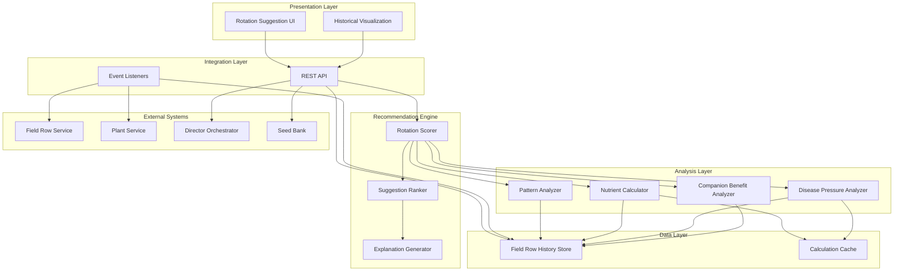

# Design Document: Crop Rotation AI System

## Overview

The Crop Rotation AI System is a recommendation engine that analyzes multi-year field row history to suggest optimal crop rotations. The system combines historical performance data, agronomic principles, and machine learning pattern recognition to generate actionable planting recommendations that improve yields, prevent disease, and maintain soil health.

The design follows a layered architecture:
- **Data Layer**: Historical storage and retrieval of field row records
- **Analysis Layer**: Pattern recognition, nutrient calculations, and disease pressure modeling
- **Recommendation Engine**: Scoring and ranking of rotation options
- **Integration Layer**: APIs for connecting with existing field row, plant, and orchestrator systems
- **Presentation Layer**: Visualization and explanation of suggestions

## Architecture

### System Components



### Data Flow

1. **Historical Data Collection**: Event listeners capture field row operations, harvests, and problems in real-time
2. **Analysis Request**: User requests rotation suggestions for upcoming season
3. **Data Retrieval**: System fetches relevant historical data for target field rows
4. **Parallel Analysis**: Multiple analyzers process data concurrently (nutrients, disease, patterns, companions)
5. **Scoring**: Rotation scorer combines analysis results into candidate suggestions
6. **Ranking**: Suggestions are ranked by expected benefit
7. **Explanation**: System generates human-readable reasoning for each suggestion
8. **Presentation**: Ranked suggestions with explanations are returned to user

## Components and Interfaces

### 1. Field Row History Store

**Purpose**: Persistent storage and efficient retrieval of multi-year field row data.

**Data Model**:

```typescript
interface FieldRowHistoryRecord {
  id: string;
  fieldRowId: string;
  seasonId: string;
  cropType: string;
  cropFamily: CropFamily;
  plantingDate: Date;
  expectedHarvestDate: Date;
  actualHarvestDate?: Date;
  yieldQuantity?: number;
  yieldQuality?: QualityRating;
  problems: ProblemRecord[];
  operations: OperationReference[];
  soilAmendments: AmendmentRecord[];
  weatherSummary: WeatherSummary;
  lunarPhases: LunarPhaseData;
}

interface ProblemRecord {
  type: 'disease' | 'pest' | 'deficiency';
  name: string;
  severity: number; // 1-10
  dateObserved: Date;
  resolved: boolean;
}

interface AmendmentRecord {
  type: string;
  quantity: number;
  unit: string;
  nutrients: NutrientContent;
  applicationDate: Date;
}

interface NutrientContent {
  nitrogen: number;
  phosphorus: number;
  potassium: number;
  micronutrients: Map<string, number>;
}
```

**Key Operations**:
- `getFieldRowHistory(fieldRowId: string, years: number): FieldRowHistoryRecord[]`
- `addHistoryRecord(record: FieldRowHistoryRecord): void`
- `updateHarvestData(recordId: string, harvest: HarvestData): void`
- `addProblem(recordId: string, problem: ProblemRecord): void`
- `getHistoryByDateRange(fieldRowId: string, start: Date, end: Date): FieldRowHistoryRecord[]`

**Storage Strategy**:
- PostgreSQL with time-series optimizations
- Partitioning by year for efficient queries
- Indexes on fieldRowId, seasonId, cropFamily, plantingDate
- Materialized views for common aggregations

### 2. Nutrient Calculator

**Purpose**: Calculate soil nutrient balance based on crop consumption and amendments.

**Algorithm**:

```
For each field row:
  1. Start with baseline nutrient levels (from soil test or defaults)
  2. For each historical season (oldest to newest):
     a. Subtract crop nutrient consumption based on yield
     b. Add nutrients from amendments
     c. Apply natural replenishment rate (soil-type dependent)
  3. Return current nutrient balance
```

**Nutrient Consumption Database**:
- Lookup table: crop type → nutrient requirements per unit yield
- Example: Tomatoes consume 2.5 kg N, 0.5 kg P, 3.0 kg K per 100 kg yield

**Interface**:

```typescript
interface NutrientCalculator {
  calculateBalance(fieldRowId: string): NutrientBalance;
  projectBalance(fieldRowId: string, proposedCrop: string, expectedYield: number): NutrientBalance;
  getNutrientDeficit(balance: NutrientBalance): NutrientDeficit;
}

interface NutrientBalance {
  nitrogen: number;
  phosphorus: number;
  potassium: number;
  micronutrients: Map<string, number>;
  lastUpdated: Date;
}

interface NutrientDeficit {
  nitrogen: number; // negative = deficit, positive = surplus
  phosphorus: number;
  potassium: number;
  limitingNutrient: string; // which nutrient is most deficient
}
```

### 3. Disease Pressure Analyzer

**Purpose**: Calculate disease risk based on crop family history and problem occurrences.

**Algorithm**:

```
For each crop family:
  1. Initialize pressure score = 0
  2. For each year in history (last 5 years):
     a. If crop family was planted:
        - Add base pressure (10 points)
        - Multiply by recency weight (current year = 1.0, 5 years ago = 0.2)
     b. If disease occurred for this family:
        - Add severity * 5 points
        - Multiply by recency weight
  3. Apply decay function (pressure decreases over time without planting)
  4. Return pressure score (0-100)
```

**Crop Family Disease Relationships**:
- Database of crop families and shared diseases
- Example: Solanaceae (tomatoes, peppers, potatoes) share late blight, early blight

**Interface**:

```typescript
interface DiseasePressureAnalyzer {
  calculatePressure(fieldRowId: string, cropFamily: CropFamily): number;
  getPressureForAllFamilies(fieldRowId: string): Map<CropFamily, number>;
  getHighRiskFamilies(fieldRowId: string, threshold: number): CropFamily[];
}

enum CropFamily {
  SOLANACEAE = 'Solanaceae',
  BRASSICACEAE = 'Brassicaceae',
  FABACEAE = 'Fabaceae',
  CUCURBITACEAE = 'Cucurbitaceae',
  APIACEAE = 'Apiaceae',
  ASTERACEAE = 'Asteraceae',
  AMARANTHACEAE = 'Amaranthaceae',
  ALLIACEAE = 'Alliaceae',
  // ... more families
}
```

### 4. Pattern Analyzer

**Purpose**: Identify successful and unsuccessful rotation sequences from historical data.

**Algorithm**:

```
1. Extract all 2-crop and 3-crop sequences from history
2. For each sequence:
   a. Calculate average yield of second/third crop
   b. Calculate problem frequency
   c. Compare to baseline (same crop without rotation context)
3. Identify sequences with >15% yield improvement as "successful"
4. Identify sequences with >20% yield decrease or high problems as "unsuccessful"
5. Weight recent sequences more heavily (exponential decay)
6. Return pattern library with confidence scores
```

**Pattern Representation**:

```typescript
interface RotationPattern {
  sequence: string[]; // e.g., ['Legumes', 'Tomatoes']
  occurrences: number;
  avgYieldImprovement: number; // percentage
  problemFrequency: number; // 0-1
  confidence: number; // 0-1, based on sample size
  lastObserved: Date;
}

interface PatternAnalyzer {
  analyzePatterns(fieldRowId: string): RotationPattern[];
  findSimilarPatterns(proposedSequence: string[]): RotationPattern[];
  getPatternScore(pattern: RotationPattern): number;
}
```

### 5. Companion Benefit Analyzer

**Purpose**: Calculate benefits or antagonisms between sequential crops.

**Companion Database**:

```typescript
interface CompanionRelationship {
  previousCrop: string;
  nextCrop: string;
  benefitType: 'nitrogen_fixation' | 'soil_structure' | 'pest_reduction' | 'nutrient_balance';
  benefitScore: number; // -10 to +10, negative = antagonism
  explanation: string;
}

// Example relationships:
const companionDB: CompanionRelationship[] = [
  {
    previousCrop: 'Legumes',
    nextCrop: 'Heavy Feeders',
    benefitType: 'nitrogen_fixation',
    benefitScore: 8,
    explanation: 'Legumes fix nitrogen, enriching soil for nitrogen-demanding crops'
  },
  {
    previousCrop: 'Tomatoes',
    nextCrop: 'Tomatoes',
    benefitType: 'pest_reduction',
    benefitScore: -7,
    explanation: 'Repeated planting increases disease and pest pressure'
  }
];
```

**Interface**:

```typescript
interface CompanionBenefitAnalyzer {
  getCompanionScore(previousCrop: string, nextCrop: string): number;
  getCompanionExplanation(previousCrop: string, nextCrop: string): string;
  findBestCompanions(previousCrop: string): string[];
}
```

### 6. Rotation Scorer

**Purpose**: Combine all analysis results into scored rotation suggestions.

**Scoring Algorithm**:

```
For each candidate crop:
  1. Nutrient Score (0-100):
     - If crop needs match soil surplus: +high score
     - If crop needs match soil deficit: -penalty
     - Legumes after heavy feeders: +bonus
  
  2. Disease Score (0-100):
     - High disease pressure for crop family: -major penalty
     - Low disease pressure: +bonus
     - Different family than last 2 years: +bonus
  
  3. Pattern Score (0-100):
     - Matches successful historical pattern: +bonus * confidence
     - Matches unsuccessful pattern: -penalty * confidence
     - No pattern data: neutral (50)
  
  4. Companion Score (0-100):
     - Positive companion relationship: +bonus
     - Negative companion relationship: -penalty
  
  5. User Preference Score (0-100):
     - User has seeds: +50
     - User marked preferred: +30
     - User marked excluded: -1000 (effectively removes)
     - Appropriate planting window: +20
  
  Total Score = weighted_sum([
    nutrient_score * 0.25,
    disease_score * 0.30,
    pattern_score * 0.20,
    companion_score * 0.15,
    preference_score * 0.10
  ])
```

**Interface**:

```typescript
interface RotationScorer {
  scoreRotationOptions(fieldRowId: string, candidateCrops: string[]): ScoredSuggestion[];
  explainScore(suggestion: ScoredSuggestion): ScoreBreakdown;
}

interface ScoredSuggestion {
  crop: string;
  cropFamily: CropFamily;
  totalScore: number;
  expectedYieldImprovement: number; // percentage
  diseaseRiskReduction: number; // percentage
  soilHealthImprovement: number; // 0-10 scale
  confidence: number; // 0-1
}

interface ScoreBreakdown {
  nutrientScore: number;
  diseaseScore: number;
  patternScore: number;
  companionScore: number;
  preferenceScore: number;
  primaryReason: string;
  contributingFactors: string[];
}
```

### 7. Suggestion Ranker

**Purpose**: Rank scored suggestions and select top recommendations.

**Ranking Strategy**:
1. Sort by total score (descending)
2. Apply diversity filter (ensure variety of crop families in top suggestions)
3. Limit to top 5 suggestions
4. Ensure minimum score threshold (>60) for inclusion

**Interface**:

```typescript
interface SuggestionRanker {
  rankSuggestions(scored: ScoredSuggestion[]): RankedSuggestion[];
  applyDiversityFilter(suggestions: ScoredSuggestion[], maxPerFamily: number): ScoredSuggestion[];
}

interface RankedSuggestion extends ScoredSuggestion {
  rank: number;
  explanation: string;
  supportingData: HistoricalEvidence;
}

interface HistoricalEvidence {
  similarPatterns: RotationPattern[];
  nutrientBalance: NutrientBalance;
  diseasePressure: Map<CropFamily, number>;
  companionBenefits: CompanionRelationship[];
}
```

### 8. Explanation Generator

**Purpose**: Generate human-readable explanations for suggestions.

**Explanation Template**:

```
Primary Reason: [Most impactful factor]

Contributing Factors:
- [Factor 1 with specific data]
- [Factor 2 with specific data]
- [Factor 3 with specific data]

Historical Context:
- [Relevant pattern or data point]

Confidence: [High/Medium/Low] based on [data availability]
```

**Interface**:

```typescript
interface ExplanationGenerator {
  generateExplanation(suggestion: RankedSuggestion, breakdown: ScoreBreakdown): string;
  generatePrimaryReason(breakdown: ScoreBreakdown): string;
  generateContributingFactors(breakdown: ScoreBreakdown): string[];
}
```

### 9. REST API

**Purpose**: Expose rotation suggestions and historical data to client applications.

**Endpoints**:

```typescript
// Get rotation suggestions for a field row
GET /api/rotation/suggestions/:fieldRowId
Query params: season (optional), limit (default 5)
Response: RankedSuggestion[]

// Get field row history
GET /api/rotation/history/:fieldRowId
Query params: years (default 5)
Response: FieldRowHistoryRecord[]

// Get historical visualizations
GET /api/rotation/visualizations/:fieldRowId
Query params: type (timeline|yield|problems|soil)
Response: VisualizationData

// Record user selection
POST /api/rotation/selection
Body: { fieldRowId, selectedCrop, seasonId }
Response: { success: boolean }

// Get nutrient balance
GET /api/rotation/nutrients/:fieldRowId
Response: NutrientBalance

// Get disease pressure
GET /api/rotation/disease-pressure/:fieldRowId
Response: Map<CropFamily, number>
```

### 10. Event Listeners

**Purpose**: Automatically update field row history when operations occur.

**Events to Listen For**:
- `plant.created` → Add new history record
- `plant.transplanted_to_field_row` → Update field row history
- `harvest.recorded` → Update yield data
- `operation.recorded` → Link operation to field row history
- `problem.reported` → Add problem to history
- `soil_amendment.applied` → Update nutrient calculations

**Interface**:

```typescript
interface HistoryEventListener {
  onPlantCreated(event: PlantCreatedEvent): void;
  onHarvestRecorded(event: HarvestEvent): void;
  onOperationRecorded(event: OperationEvent): void;
  onProblemReported(event: ProblemEvent): void;
  onAmendmentApplied(event: AmendmentEvent): void;
}
```

## Data Models

### Database Schema

**field_row_history table**:
```sql
CREATE TABLE field_row_history (
  id UUID PRIMARY KEY,
  field_row_id UUID NOT NULL REFERENCES field_rows(id),
  season_id UUID NOT NULL,
  crop_type VARCHAR(100) NOT NULL,
  crop_family VARCHAR(50) NOT NULL,
  planting_date DATE NOT NULL,
  expected_harvest_date DATE,
  actual_harvest_date DATE,
  yield_quantity DECIMAL(10,2),
  yield_quality VARCHAR(20),
  created_at TIMESTAMP DEFAULT NOW(),
  updated_at TIMESTAMP DEFAULT NOW()
) PARTITION BY RANGE (planting_date);

CREATE INDEX idx_field_row_history_field_row ON field_row_history(field_row_id);
CREATE INDEX idx_field_row_history_season ON field_row_history(season_id);
CREATE INDEX idx_field_row_history_crop_family ON field_row_history(crop_family);
CREATE INDEX idx_field_row_history_planting_date ON field_row_history(planting_date);
```

**history_problems table**:
```sql
CREATE TABLE history_problems (
  id UUID PRIMARY KEY,
  history_record_id UUID NOT NULL REFERENCES field_row_history(id),
  problem_type VARCHAR(20) NOT NULL CHECK (problem_type IN ('disease', 'pest', 'deficiency')),
  problem_name VARCHAR(100) NOT NULL,
  severity INTEGER CHECK (severity BETWEEN 1 AND 10),
  date_observed DATE NOT NULL,
  resolved BOOLEAN DEFAULT FALSE,
  created_at TIMESTAMP DEFAULT NOW()
);

CREATE INDEX idx_history_problems_record ON history_problems(history_record_id);
CREATE INDEX idx_history_problems_type ON history_problems(problem_type);
```

**history_amendments table**:
```sql
CREATE TABLE history_amendments (
  id UUID PRIMARY KEY,
  history_record_id UUID NOT NULL REFERENCES field_row_history(id),
  amendment_type VARCHAR(100) NOT NULL,
  quantity DECIMAL(10,2) NOT NULL,
  unit VARCHAR(20) NOT NULL,
  nitrogen DECIMAL(10,2) DEFAULT 0,
  phosphorus DECIMAL(10,2) DEFAULT 0,
  potassium DECIMAL(10,2) DEFAULT 0,
  micronutrients JSONB,
  application_date DATE NOT NULL,
  created_at TIMESTAMP DEFAULT NOW()
);

CREATE INDEX idx_history_amendments_record ON history_amendments(history_record_id);
```

**rotation_patterns table** (cached patterns):
```sql
CREATE TABLE rotation_patterns (
  id UUID PRIMARY KEY,
  sequence TEXT[] NOT NULL,
  occurrences INTEGER DEFAULT 1,
  avg_yield_improvement DECIMAL(5,2),
  problem_frequency DECIMAL(3,2),
  confidence DECIMAL(3,2),
  last_observed DATE,
  created_at TIMESTAMP DEFAULT NOW(),
  updated_at TIMESTAMP DEFAULT NOW()
);

CREATE INDEX idx_rotation_patterns_sequence ON rotation_patterns USING GIN(sequence);
```

**companion_relationships table**:
```sql
CREATE TABLE companion_relationships (
  id UUID PRIMARY KEY,
  previous_crop VARCHAR(100) NOT NULL,
  next_crop VARCHAR(100) NOT NULL,
  benefit_type VARCHAR(50) NOT NULL,
  benefit_score INTEGER CHECK (benefit_score BETWEEN -10 AND 10),
  explanation TEXT,
  created_at TIMESTAMP DEFAULT NOW()
);

CREATE INDEX idx_companion_prev_next ON companion_relationships(previous_crop, next_crop);
```

### Caching Strategy

**Nutrient Balance Cache**:
- Cache calculated nutrient balances with TTL of 24 hours
- Invalidate on new amendments or harvests
- Key: `nutrient_balance:{fieldRowId}`

**Disease Pressure Cache**:
- Cache disease pressure scores with TTL of 7 days
- Invalidate on new problems or plantings
- Key: `disease_pressure:{fieldRowId}`

**Pattern Cache**:
- Materialized view refreshed weekly
- Stores pre-calculated patterns for common sequences


## Correctness Properties

A property is a characteristic or behavior that should hold true across all valid executions of a system—essentially, a formal statement about what the system should do. Properties serve as the bridge between human-readable specifications and machine-verifiable correctness guarantees.

### Property 1: History Record Completeness

*For any* planting, harvest, operation, problem, or amendment event, when recorded in the system, all required fields for that event type SHALL be present and non-null in the stored history record.

**Validates: Requirements 1.1, 1.2, 1.3, 1.4, 1.5**

### Property 2: History Data Retention

*For any* field row history record created with a date at least 10 years in the past, querying for that record SHALL successfully return the complete record data.

**Validates: Requirements 1.6**

### Property 3: Nutrient Consumption Calculation

*For any* crop planting event, the system SHALL calculate and store expected nutrient consumption values for N, P, K, and micronutrients based on the crop type and expected yield.

**Validates: Requirements 2.1**

### Property 4: Nutrient Balance Updates

*For any* harvest event or amendment application, the nutrient balance for the affected field row SHALL change by an amount corresponding to the actual yield consumed or nutrients added.

**Validates: Requirements 2.2, 2.3**

### Property 5: Independent Nutrient Tracking

*For any* field row, the nutrient balance SHALL maintain separate, independent values for nitrogen, phosphorus, potassium, and each tracked micronutrient.

**Validates: Requirements 2.4**

### Property 6: Natural Nutrient Replenishment

*For any* field row with no crops or amendments over a time period, the nutrient balance SHALL increase according to the natural replenishment rate for that soil type.

**Validates: Requirements 2.5**

### Property 7: Disease Pressure Time Window

*For any* disease pressure calculation, only crop families planted within the last 3 years SHALL contribute to the pressure score.

**Validates: Requirements 3.1**

### Property 8: Disease Pressure Accumulation

*For any* crop family, repeatedly planting that family or recording disease occurrences SHALL monotonically increase the disease pressure score for that family.

**Validates: Requirements 3.2, 3.3**

### Property 9: Disease Pressure Decay

*For any* crop family not planted in a field row for multiple years, the disease pressure score for that family SHALL decrease over time.

**Validates: Requirements 3.4**

### Property 10: Independent Family Pressure Scores

*For any* field row, disease pressure scores SHALL be calculated independently for each crop family, such that planting one family does not directly affect unrelated families' scores.

**Validates: Requirements 3.5**

### Property 11: Related Family Pressure

*For any* two crop families with known disease relationships (e.g., Solanaceae members), planting one family SHALL increase disease pressure for the related family.

**Validates: Requirements 3.6**

### Property 12: Pattern Classification

*For any* crop sequence in the historical data, the pattern analyzer SHALL classify it as successful (above-average yield, low problems), unsuccessful (below-average yield or high problems), or neutral based on the outcome metrics.

**Validates: Requirements 4.1, 4.2, 4.3, 4.4**

### Property 13: Recency Weighting

*For any* two identical crop sequences occurring in different years, the more recent sequence SHALL have a higher weight in pattern analysis than the older sequence.

**Validates: Requirements 4.5**

### Property 14: Fallback Suggestions

*For any* field row with insufficient historical data (fewer than 2 complete seasons), the system SHALL still generate at least 3 rotation suggestions using general agronomic principles.

**Validates: Requirements 4.6**

### Property 15: Minimum Suggestion Count

*For any* field row, generating rotation suggestions SHALL produce at least 3 distinct crop options.

**Validates: Requirements 5.1**

### Property 16: Suggestion Ranking Order

*For any* set of rotation suggestions, the suggestions SHALL be ordered by total score in descending order (highest score first).

**Validates: Requirements 5.2**

### Property 17: Suggestion Metrics Completeness

*For any* rotation suggestion, the system SHALL calculate and include expected yield improvement percentage, disease risk reduction score, and soil health improvement score.

**Validates: Requirements 5.3, 5.4, 5.5**

### Property 18: Suggestion Explanation Presence

*For any* rotation suggestion, the system SHALL provide a non-empty, human-readable explanation string.

**Validates: Requirements 5.6**

### Property 19: Companion Benefit Scoring

*For any* crop rotation where the previous crop and next crop have a defined companion relationship, the suggestion score SHALL be adjusted according to the companion benefit score (positive for beneficial, negative for antagonistic).

**Validates: Requirements 6.1, 6.2, 6.3, 6.5**

### Property 20: Seed Bank Filtering

*For any* rotation suggestion generated, the suggested crop SHALL exist in the user's seed bank inventory.

**Validates: Requirements 7.1**

### Property 21: User Preference Scoring

*For any* two crops where one is marked as preferred and the other is not, the preferred crop SHALL receive a higher suggestion score (all other factors being equal).

**Validates: Requirements 7.2**

### Property 22: Crop Exclusion Filtering

*For any* crop marked as excluded by the user, that crop SHALL NOT appear in the rotation suggestions.

**Validates: Requirements 7.3**

### Property 23: Seasonal Appropriateness

*For any* rotation suggestion generated on a specific date, the suggested crops SHALL have planting windows that include or are near that date.

**Validates: Requirements 7.4**

### Property 24: Custom Rule Enforcement

*For any* user-defined rotation rule (e.g., "never plant tomatoes after peppers"), the system SHALL NOT generate suggestions that violate that rule.

**Validates: Requirements 7.5**

### Property 25: Visualization Data Completeness

*For any* field row with historical data, the visualization data SHALL include timeline entries for all years, yield comparisons for all crops planted, problem frequency aggregations, and soil health trend calculations.

**Validates: Requirements 8.1, 8.2, 8.3, 8.4**

### Property 26: Event-Driven History Updates

*For any* plant addition, operation recording, or harvest event affecting a field row, the field row history SHALL be automatically updated with the corresponding data within the same transaction.

**Validates: Requirements 9.1, 9.2, 9.3**

### Property 27: Seed Bank Integration

*For any* rotation suggestion request, the system SHALL query the seed bank and only suggest crops for which seeds are available.

**Validates: Requirements 9.5**

### Property 28: Incomplete Data Quality Indicators

*For any* historical record with missing required fields, the system SHALL mark that record with a data quality indicator showing which fields are incomplete.

**Validates: Requirements 10.4**

### Property 29: Explanation Completeness

*For any* rotation suggestion, the explanation SHALL include a primary reason, a list of contributing factors, and relevant historical evidence supporting the recommendation.

**Validates: Requirements 11.1, 11.2, 11.3**

### Property 30: Confidence Level Indication

*For any* rotation suggestion, the system SHALL calculate and display a confidence level (high/medium/low) based on the quantity and quality of available historical data.

**Validates: Requirements 11.4**

### Property 31: Fallback Mode Transparency

*For any* rotation suggestion generated using general agronomic principles (due to insufficient history), the explanation SHALL explicitly indicate that fallback mode was used.

**Validates: Requirements 11.5**

### Property 32: Calculation Caching

*For any* nutrient balance or disease pressure calculation performed twice for the same field row without intervening data changes, the second calculation SHALL return cached results identical to the first calculation.

**Validates: Requirements 12.3**

### Property 33: Concurrent Request Isolation

*For any* two concurrent rotation suggestion requests for different field rows, the results SHALL be independent and unaffected by the concurrent execution.

**Validates: Requirements 12.4**

## Error Handling

### Error Categories

1. **Data Validation Errors**
   - Invalid crop types or families
   - Missing required fields
   - Out-of-range values (e.g., negative yields, invalid dates)
   - **Handling**: Return 400 Bad Request with specific field errors

2. **Data Integrity Errors**
   - Referenced field row doesn't exist
   - Referenced season doesn't exist
   - Orphaned history records
   - **Handling**: Return 404 Not Found or 409 Conflict with explanation

3. **Calculation Errors**
   - Division by zero in yield calculations
   - Missing nutrient data for crop types
   - Invalid soil type for replenishment calculations
   - **Handling**: Log error, use safe defaults, return partial results with warnings

4. **Integration Errors**
   - Seed bank service unavailable
   - Director Orchestrator timeout
   - External service returns invalid data
   - **Handling**: Retry with exponential backoff, fallback to cached data, return degraded results

5. **Performance Errors**
   - Query timeout on large historical datasets
   - Cache miss on expensive calculations
   - **Handling**: Return 503 Service Unavailable with retry-after header

### Error Recovery Strategies

**Graceful Degradation**:
- If seed bank is unavailable, suggest all crops with a warning
- If pattern analysis fails, rely more heavily on nutrient and disease scores
- If historical data is incomplete, use general principles with lower confidence

**Transaction Rollback**:
- All history updates wrapped in database transactions
- Failed migrations rollback completely
- Event processing failures don't leave partial updates

**Retry Logic**:
- External service calls: 3 retries with exponential backoff (1s, 2s, 4s)
- Database deadlocks: automatic retry up to 5 times
- Cache failures: fall through to direct calculation

**Error Logging**:
- All errors logged with context (field row ID, user ID, operation)
- Critical errors (data corruption, migration failures) trigger alerts
- Performance errors tracked for optimization

## Testing Strategy

### Dual Testing Approach

The Crop Rotation AI System requires both unit testing and property-based testing for comprehensive coverage:

**Unit Tests** focus on:
- Specific examples of rotation suggestions (e.g., legumes → tomatoes)
- Edge cases (empty history, single season, missing data)
- Error conditions (invalid inputs, service failures)
- Integration points (API endpoints, event handlers)
- Specific calculation examples (known nutrient values, disease scores)

**Property-Based Tests** focus on:
- Universal properties that hold for all inputs (see Correctness Properties section)
- Comprehensive input coverage through randomization
- Invariants that must be maintained (data completeness, score ordering)
- Round-trip properties (store → retrieve → verify)

### Property-Based Testing Configuration

**Library Selection**:
- **TypeScript/JavaScript**: fast-check
- **Python**: Hypothesis
- **Java**: jqwik

**Test Configuration**:
- Minimum 100 iterations per property test
- Each test tagged with: **Feature: crop-rotation-ai-system, Property {N}: {property_text}**
- Seed value logged for reproducibility
- Shrinking enabled to find minimal failing cases

**Generator Strategy**:
- Custom generators for domain objects (FieldRowHistoryRecord, NutrientBalance, etc.)
- Constrained generators for valid data (positive yields, valid dates, enum values)
- Edge case generators (empty lists, boundary values, null fields)

### Test Organization

```
tests/
├── unit/
│   ├── nutrient-calculator.test.ts
│   ├── disease-pressure-analyzer.test.ts
│   ├── pattern-analyzer.test.ts
│   ├── rotation-scorer.test.ts
│   ├── api-endpoints.test.ts
│   └── event-handlers.test.ts
├── property/
│   ├── history-recording.property.test.ts
│   ├── nutrient-calculations.property.test.ts
│   ├── disease-pressure.property.test.ts
│   ├── pattern-recognition.property.test.ts
│   ├── suggestion-generation.property.test.ts
│   └── integration.property.test.ts
├── integration/
│   ├── end-to-end-rotation.test.ts
│   ├── migration.test.ts
│   └── external-services.test.ts
└── generators/
    ├── field-row-generators.ts
    ├── crop-generators.ts
    └── history-generators.ts
```

### Example Property Test

```typescript
// Feature: crop-rotation-ai-system, Property 16: Suggestion Ranking Order
describe('Suggestion Ranking Order', () => {
  it('should order suggestions by total score descending', async () => {
    await fc.assert(
      fc.asyncProperty(
        fieldRowWithHistoryGenerator(),
        async (fieldRow) => {
          const suggestions = await rotationScorer.scoreRotationOptions(
            fieldRow.id,
            ALL_CROP_TYPES
          );
          
          // Verify suggestions are in descending score order
          for (let i = 0; i < suggestions.length - 1; i++) {
            expect(suggestions[i].totalScore).toBeGreaterThanOrEqual(
              suggestions[i + 1].totalScore
            );
          }
        }
      ),
      { numRuns: 100 }
    );
  });
});
```

### Coverage Goals

- Unit test coverage: >85% of lines
- Property test coverage: 100% of correctness properties
- Integration test coverage: All API endpoints and event handlers
- Edge case coverage: All error conditions and boundary values

### Performance Testing

- Load testing: 100 concurrent users generating suggestions
- Stress testing: 10,000 field rows with 10 years of history each
- Benchmark testing: Query performance with various dataset sizes
- Cache effectiveness: Hit rate monitoring and optimization

### Migration Testing

- Test migration with sample production data
- Verify data integrity after migration
- Test rollback procedures
- Measure migration performance at scale
