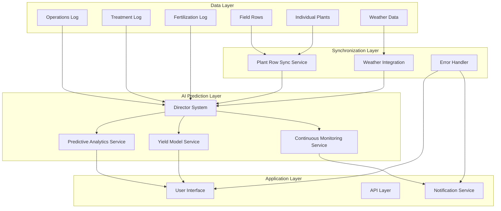
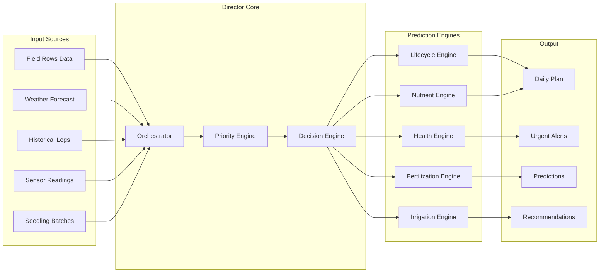

# Design Document

## Overview

This design addresses critical issues in the field rows system and provides comprehensive documentation of the AI prediction system architecture. The solution integrates field row management with weather data, operations tracking, and predictive analytics through a centralized Director system that orchestrates all prediction engines.

The system follows a layered architecture where field rows serve as the foundation for plant cultivation data, which feeds into multiple prediction engines coordinated by the Director system to generate actionable insights and recommendations.

## Architecture

### High-Level Architecture



### Director System Architecture



## Components and Interfaces

### Field Row Storage Provider Interface

```typescript
interface IFieldRowStorageProvider {
  // Core CRUD operations
  createFieldRow(data: CreateFieldRowData): Promise<FieldRow>
  updateFieldRow(id: string, data: UpdateFieldRowData): Promise<FieldRow>
  getFieldRows(gardenId: string): Promise<FieldRow[]>
  getFieldRow(id: string): Promise<FieldRow | null>
  deleteFieldRow(id: string): Promise<void>
  
  // Validation and error handling
  validateFieldRowData(data: FieldRowData): ValidationResult
  logOperation(operation: string, data: any, result: any): void
}

interface CreateFieldRowData {
  gardenId: string
  name: string
  rowNumber: number
  lengthMeters: number
  distanceFromPreviousRow?: number
  cultivar?: string
  plantSpacing?: number
  plantedDate?: string
  orientation?: FieldRowOrientation
  irrigationConfig?: IrrigationConfig
  isActive: boolean
}

interface IrrigationConfig {
  enabled: boolean
  irrigationType: 'drip' | 'sprinkler' | 'micro_sprinkler' | 'manual'
  tubeLength: number
  tubeDiameter: number
  emitterSpacing: number
  emitterFlowRate: number
  flowRatePerMeter: number
  totalFlowRate: number
  pressure: number
  schedule: IrrigationSchedule
}
```

### Error Handling System

```typescript
interface IErrorHandler {
  captureError(error: Error, context: ErrorContext): void
  logOperation(operation: string, details: OperationDetails): void
  validateStorageProvider(provider: any): ValidationResult
  generateUserFriendlyMessage(error: Error): string
  createDebugInfo(context: any): DebugInfo
}

interface ErrorContext {
  component: string
  operation: string
  userId?: string
  gardenId?: string
  fieldRowId?: string
  additionalData?: Record<string, any>
}

interface DebugInfo {
  timestamp: string
  environment: string
  userAgent: string
  storageProviderMethods: string[]
  operationTrace: OperationStep[]
}
```

### Director System Interface

```typescript
interface IDirectorSystem {
  generateDailyPlan(
    garden: Garden,
    tasks: GardenTask[],
    currentDate?: Date,
    options?: DirectorOptions
  ): Promise<DailyPlan>
  
  generateUrgentAlerts(coordinates: Coordinates): Promise<UrgentAlert[]>
  
  integrateFieldRowData(
    fieldRows: FieldRow[],
    weatherData: WeatherData,
    operations: Operation[]
  ): Promise<IntegratedData>
  
  orchestratePredictions(data: IntegratedData): Promise<PredictionResults>
}

interface DirectorOptions {
  annualPlan?: AnnualPlan
  userProfile?: UserProfile
  seedlingBatches?: SeedlingBatch[]
  storageProvider?: IStorageProvider
  seedInventory?: SeedPacket[]
}
```

### Predictive Analytics Interface

```typescript
interface IPredictiveAnalyticsService {
  predictOptimalHarvestDate(
    task: GardenTask,
    masterData: PlantMasterSheet,
    garden: Garden,
    currentDate?: Date
  ): Promise<HarvestPrediction>
  
  predictYield(
    fieldRow: FieldRow,
    historicalData: HarvestLogData[],
    weatherForecast: WeatherForecast[]
  ): Promise<YieldPrediction>
  
  assessDiseaseRisk(
    plants: GardenPlant[],
    weatherConditions: WeatherConditions,
    historicalPatterns: DiseasePattern[]
  ): Promise<DiseaseRiskPrediction>
  
  calculateWaterRequirements(
    fieldRows: FieldRow[],
    weatherForecast: WeatherForecast[],
    soilConditions: SoilConditions
  ): Promise<WaterRequirementPrediction>
}
```

### Continuous Monitoring Interface

```typescript
interface IContinuousMonitoringService {
  startMonitoring(gardenId: string, config?: MonitoringConfig): void
  stopMonitoring(gardenId: string): void
  
  analyzeGardenHealth(
    garden: Garden,
    plants: GardenPlant[],
    tasks: GardenTask[],
    operations: PlantOperation[]
  ): Promise<MonitoringResult>
  
  generateAlerts(
    healthStatus: PlantHealthStatus[],
    thresholds: AlertThresholds
  ): Promise<MonitoringAlert[]>
  
  integrateWithDirector(
    garden: Garden,
    tasks: GardenTask[]
  ): Promise<MonitoringAlert[]>
}
```

## Data Models

### Enhanced Field Row Model

```typescript
interface FieldRow {
  id: string
  gardenId: string
  name: string
  rowNumber: number
  lengthMeters: number
  distanceFromPreviousRow?: number
  cultivar?: string
  plantSpacing?: number
  plantedDate?: string
  orientation?: FieldRowOrientation
  irrigationConfig?: IrrigationConfig
  isActive: boolean
  
  // Computed fields
  estimatedPlantCount?: number
  totalIrrigationFlow?: number
  
  // Metadata
  createdAt: string
  updatedAt: string
  version: number
}

type FieldRowOrientation = 'N-S' | 'E-W' | 'NE-SW' | 'NW-SE'
```

### AI Prediction Data Models

```typescript
interface PredictionResults {
  harvestPredictions: HarvestPrediction[]
  yieldPredictions: YieldPrediction[]
  diseaseRiskAssessments: DiseaseRiskPrediction[]
  waterRequirements: WaterRequirementPrediction[]
  recommendations: Recommendation[]
  confidence: ConfidenceMetrics
}

interface ConfidenceMetrics {
  overall: number // 0-1
  dataQuality: number // 0-1
  modelAccuracy: number // 0-1
  weatherReliability: number // 0-1
  historicalDataAvailability: number // 0-1
}

interface Recommendation {
  id: string
  type: 'irrigation' | 'fertilization' | 'treatment' | 'harvest' | 'planting'
  priority: 'low' | 'medium' | 'high' | 'critical'
  title: string
  description: string
  suggestedDate: string
  estimatedDuration: number
  requiredResources: string[]
  expectedOutcome: string
  confidence: number
  reasoning: string[]
}
```

### Integration Data Models

```typescript
interface IntegratedData {
  fieldRows: FieldRow[]
  individualPlants: GardenPlant[]
  weatherData: WeatherData
  operations: Operation[]
  treatments: Treatment[]
  fertilizations: Fertilization[]
  sensorReadings: SensorReading[]
  historicalPatterns: HistoricalPattern[]
}

interface SyncResult {
  success: boolean
  syncedRecords: number
  conflicts: DataConflict[]
  errors: SyncError[]
  timestamp: string
}
```

## Correctness Properties

*A property is a characteristic or behavior that should hold true across all valid executions of a system—essentially, a formal statement about what the system should do. Properties serve as the bridge between human-readable specifications and machine-verifiable correctness guarantees.*

### Property 1: Field Row Data Persistence
*For any* valid field row data, saving it to the system should result in the data being retrievable with all fields preserved exactly as saved, and updates should preserve unchanged fields while applying modifications correctly.
**Validates: Requirements 1.1, 1.2, 2.2**

### Property 2: Irrigation Configuration State Preservation  
*For any* field row with irrigation configuration, the enabled/disabled state should be preserved correctly using Boolean conversion across save/load cycles and modal reopens.
**Validates: Requirements 2.1, 2.3**

### Property 3: Comprehensive Error Handling
*For any* operation failure or invalid input, the system should capture complete error context, provide user-friendly messages, log technical details, and detect silent failures with actionable information.
**Validates: Requirements 1.3, 4.1, 4.3, 4.5**

### Property 4: System-wide Logging
*For any* storage operation, irrigation configuration loading, or system operation, appropriate debug logs should be created with operation details and execution status.
**Validates: Requirements 1.4, 2.4, 4.2**

### Property 5: Input Validation
*For any* field row data with missing required fields or invalid irrigation parameters, the system should validate and reject the data before attempting save operations.
**Validates: Requirements 1.5**

### Property 6: Automatic Calculation Updates
*For any* change to irrigation parameters, dependent values (flow rates, emitter counts, totals) should be recalculated automatically and consistently.
**Validates: Requirements 2.5**

### Property 7: Data Synchronization Consistency
*For any* field row data change or operation recording, all related systems (Plant Row Sync Service, individual plant records, tracking systems) should be updated consistently and simultaneously.
**Validates: Requirements 5.1, 5.3, 8.1, 8.3**

### Property 8: Weather Integration and Prediction Updates
*For any* weather data update, the Director System should incorporate the new data into prediction calculations and adjust forecasts accordingly.
**Validates: Requirements 5.2, 7.2**

### Property 9: Comprehensive Monitoring and Alerting
*For any* environmental condition change or critical threshold exceedance, the Continuous Monitoring Service should generate appropriately prioritized alerts with actionable recommendations while avoiding duplicate notifications.
**Validates: Requirements 6.1, 6.2, 6.3, 6.5**

### Property 10: Director System Integration
*For any* monitoring alert or data source combination, the system should integrate alerts with the Director system and analyze all data sources to generate coordinated responses and real-time alerts.
**Validates: Requirements 5.4, 6.4**

### Property 11: Predictive Analytics Generation
*For any* sufficient data combination (field rows, weather, operations), the Predictive Analytics Service should generate harvest predictions, yield forecasts, disease risk assessments, and water requirements with confidence levels and data source explanations.
**Validates: Requirements 5.5, 7.1, 7.3, 7.4, 7.5**

### Property 12: Data Consistency Maintenance
*For any* individual plant data update or field row configuration change, the system should maintain consistency between plant-level and row-level data, automatically detecting and resolving inconsistencies where possible.
**Validates: Requirements 8.2, 8.4**

### Property 13: Failure Recovery and Resilience
*For any* synchronization failure or temporary service failure, the system should log the failure, provide recovery mechanisms, recover gracefully, and prioritize critical operations under resource constraints.
**Validates: Requirements 8.5, 9.4, 9.5**

### Property 14: User Experience Transparency
*For any* prediction display, recommendation generation, or system status change, the system should provide clear explanations, show data sources and reasoning, and guide users toward resolution steps when errors occur.
**Validates: Requirements 10.1, 10.2, 10.3, 10.5**

## Error Handling

### Error Classification System

```typescript
enum ErrorType {
  VALIDATION_ERROR = 'validation_error',
  STORAGE_ERROR = 'storage_error', 
  NETWORK_ERROR = 'network_error',
  INTEGRATION_ERROR = 'integration_error',
  PREDICTION_ERROR = 'prediction_error',
  SYNCHRONIZATION_ERROR = 'synchronization_error'
}

enum ErrorSeverity {
  LOW = 'low',
  MEDIUM = 'medium', 
  HIGH = 'high',
  CRITICAL = 'critical'
}
```

### Error Handling Strategies

1. **Field Row Saving Errors**
   - Validate storage provider method availability before operations
   - Capture complete error context including stack traces
   - Provide specific error messages based on failure type
   - Log all operation attempts with detailed debugging information

2. **Irrigation Persistence Errors**
   - Implement Boolean conversion validation for irrigation state
   - Add debug logging for irrigation configuration loading/saving
   - Validate irrigation parameter calculations before persistence
   - Provide rollback mechanisms for failed irrigation updates

3. **AI Prediction Errors**
   - Handle missing or insufficient data gracefully
   - Provide confidence metrics with all predictions
   - Implement fallback prediction methods when primary algorithms fail
   - Log prediction generation failures with data quality metrics

4. **Integration Errors**
   - Implement retry mechanisms for temporary service failures
   - Provide circuit breaker patterns for external service calls
   - Maintain data consistency during partial failure scenarios
   - Queue operations for retry when services are unavailable

### Error Recovery Mechanisms

```typescript
interface ErrorRecoveryStrategy {
  canRecover(error: SystemError): boolean
  recover(error: SystemError, context: ErrorContext): Promise<RecoveryResult>
  getRecoveryInstructions(error: SystemError): string[]
}

interface RecoveryResult {
  success: boolean
  message: string
  suggestedActions: string[]
  requiresUserIntervention: boolean
}
```

## Testing Strategy

### Dual Testing Approach

The system requires both unit testing and property-based testing for comprehensive coverage:

**Unit Tests** focus on:
- Specific error scenarios and edge cases
- Integration points between components  
- Mock service interactions
- UI component behavior
- Configuration validation

**Property Tests** focus on:
- Universal behaviors across all inputs
- Data consistency and synchronization
- Error handling across all failure types
- Prediction accuracy across data variations
- System resilience under various conditions

### Property-Based Testing Configuration

- **Testing Library**: Use fast-check for TypeScript/JavaScript property-based testing
- **Test Iterations**: Minimum 100 iterations per property test
- **Test Tagging**: Each property test must reference its design document property
- **Tag Format**: `Feature: field-rows-ai-system-integration, Property {number}: {property_text}`

### Testing Coverage Areas

1. **Field Row Management**
   - Data persistence and retrieval
   - Irrigation configuration handling
   - Validation and error scenarios
   - UI state management

2. **AI Prediction System**
   - Director system orchestration
   - Prediction engine integration
   - Data flow validation
   - Confidence metric accuracy

3. **System Integration**
   - Service synchronization
   - Error propagation
   - Recovery mechanisms
   - Performance under load

4. **User Experience**
   - Error message clarity
   - Debug information availability
   - Prediction transparency
   - Recommendation explanations

### Test Data Generation

Property tests should generate:
- Random field row configurations with valid constraints
- Various irrigation parameter combinations
- Simulated weather data patterns
- Mock operation and treatment logs
- Error conditions and edge cases
- Large datasets for performance testing

The testing strategy ensures that both specific scenarios (unit tests) and general behaviors (property tests) are validated, providing comprehensive coverage of the system's correctness properties.