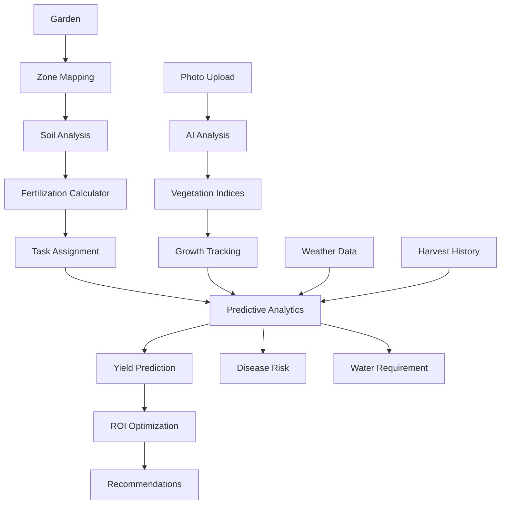

# OrtoMio AI - Architettura

## Panoramica

OrtoMio AI è un'applicazione React TypeScript che fornisce assistenza agronomica personalizzata per giardinieri italiani. L'architettura è progettata per supportare sia una versione Free (localStorage) che Pro (Supabase cloud).

## Architettura a Livelli

```text
┌─────────────────────────────────────────────────────────┐
│                    UI Layer                              │
│  Dashboard | Planner | Journal | HarvestLog | etc.      │
└──────────────────────┬──────────────────────────────────┘
                       │
┌──────────────────────▼──────────────────────────────────┐
│                 Feature Flags Layer                     │
│              TierProvider (FREE/PRO)                    │
└──────────────────────┬──────────────────────────────────┘
                       │
┌──────────────────────▼──────────────────────────────────┐
│              Storage Abstraction Layer                  │
│  IStorageProvider → LocalStorageProvider                │
│                    ↓ SupabaseStorageProvider            │
└──────────────────────┬──────────────────────────────────┘
                       │
┌──────────────────────▼──────────────────────────────────┐
│                  Logic Engines                          │
│  Director | Nutrient | Health | Lifecycle | etc.       │
└──────────────────────┬──────────────────────────────────┘
                       │
┌──────────────────────▼──────────────────────────────────┐
│              Data Layer                                  │
│  localStorage (Free) | Supabase (Pro)                   │
└─────────────────────────────────────────────────────────┘

```text

## Componenti Principali

### Storage Abstraction

L'app usa un'interfaccia `IStorageProvider` che permette di switchare tra localStorage (Free) e Supabase (Pro) senza modificare il codice dell'applicazione.

### File:

- `packages/core/storage/interface.ts` - Interfaccia

- `packages/storage-local/LocalStorageProvider.ts` - Implementazione localStorage

- `packages/storage-cloud/SupabaseStorageProvider.ts` - Implementazione Supabase

- `packages/core/storage/factory.ts` - Factory per creare provider

### Feature Flags (Tier System)

Il sistema di tier permette di abilitare/disabilitare funzionalità in base alla versione (Free/Pro).

### File:

- `packages/core/config/tiers.ts` - Configurazione tier

- `packages/core/context/TierContext.tsx` - React Context

- `packages/core/hooks/useTier.ts` - Hook per accesso tier

### Logic Engines

Motori logici puri (pure functions) che calcolano consigli agronomici:

- **Director** (`logic/director.ts`) - Orchestratore centrale che coordina tutti i motori
  - Integra classificazione solare stagionale come PRIORITÀ 1.5
  - Valida compatibilità piante con tipo di orto
  - Filtra prodotti fitosanitari in base a patentino/preferenze utente
  - Ottimizza timing basandosi su finestre di impianto solari

- **Solar Classification Helper** (`logic/solarClassificationHelper.ts`) - Helper per classificazione solare
  - Calcola classificazione solare completa per giardino
  - Valida compatibilità piante con tipo di orto
  - Ottiene suggerimenti piante ottimizzati

- **Nutrient Engine** (`logic/nutrientEngine.ts`) - Calcolo fabbisogni NPK

- **Health Engine** (`logic/healthEngine.ts`) - Prevenzione malattie
  - Filtra prodotti in base a UserProfile (patentino, preferenze trattamento)

- **Lifecycle Engine** (`logic/lifecycleEngine.ts`) - Gestione fasi crescita

- **Rotation Engine** (`logic/rotationEngine.ts`) - Rotazione culturale

- **Companion Engine** (`logic/companionEngine.ts`) - Consociazioni

- **Seasonal Engine** (`logic/seasonalEngine.ts`) - Consigli stagionali

## Flusso Dati Free vs Pro

### Free Tier

1. Dati salvati in `localStorage`

1. `LocalStorageProvider` gestisce CRUD

1. Nessuna sincronizzazione cloud

1. Limiti: 1 orto, 50 task, 20 semi

### Pro Tier

1. Dati salvati in Supabase PostgreSQL

1. `SupabaseStorageProvider` gestisce CRUD

1. Sincronizzazione automatica

1. Nessun limite

1. Features aggiuntive: time-lapse, analytics, meteo avanzato

## Database Schema (Supabase)

Vedi `database/schema.sql` per schema completo.

Tabelle principali:

- `gardens` - Orti utente

- `garden_tasks` - Task e attività

- `garden_beds` - Aiuole

- `bed_planting_history` - Storico rotazioni

- `harvest_logs` - Raccolti

- `photo_logs` - Foto time-lapse (Pro)

- `seed_inventory` - Inventario semi

- `weather_cache` - Cache previsioni meteo

## Security

- **Row Level Security (RLS)** su tutte le tabelle Supabase

- Ogni utente può accedere solo ai propri dati

- Validazione input lato client e server

## Performance

- **Caching intelligente**: Weather cache (24h), calcoli ripetuti

- **Lazy loading**: Componenti Pro caricati solo se necessario

- **Code splitting**: Possibile con dynamic imports

## Precision Agriculture Architecture

Il sistema di agricoltura di precisione estende l'architettura base con:

### Zone Mapping System

**Servizi**:
- `services/zoneMappingService.ts` - Gestione zone orto
- `services/zoneSpecificAdvice.ts` - Suggerimenti per zona

**Componenti**:
- `components/planner/ZoneMappingTool.tsx` - UI mappatura zone
- `components/VisualGardenPlanner.tsx` - Integrazione zone overlay

**Database**:
- `garden_zones` - Tabelle zone con caratteristiche
- `garden_tasks.zone_id` - Riferimento task a zona

### Soil Analysis System

**Servizi**:
- `services/soilAnalysisService.ts` - Gestione analisi suolo
- `services/fertilizationCalculator.ts` - Calcolo dosaggi precisi

**Componenti**:
- `components/soilAnalysis/SoilAnalysisForm.tsx` - Form inserimento analisi

**Database**:
- `soil_analysis` - Analisi complete macro/micro-nutrienti
- Calcolo automatico raccomandazioni fertilizzazione

### Vegetation Indices System

**Servizi**:
- `services/vegetationIndexService.ts` - Calcolo NDVI/EVI/LAI da foto RGB
- `services/photoLogService.ts` - Integrazione calcolo automatico

**Componenti**:
- `components/plantTracking/VegetationIndicesChart.tsx` - Visualizzazione trend

**Database**:
- `vegetation_indices` - Storico indici calcolati
- `photo_logs.vegetation_indices_id` - Riferimento foto-indici

**Flusso**:
1. Utente carica foto pianta
2. AI analizza salute pianta
3. Sistema calcola automaticamente indici vegetativi
4. Indicatori salvati nel database
5. Grafici temporali mostrano trend

### Predictive Analytics System

**Servizi**:
- `services/predictiveAnalyticsService.ts` - Previsioni resa/raccolto/malattie/idrico
- `services/yieldModelService.ts` - Modelli predittivi resa e ROI

**Componenti**:
- `components/analytics/PredictiveDashboard.tsx` - Dashboard previsioni
- `components/analytics/YieldOptimizer.tsx` - Ottimizzazione ROI

**Database**:
- `yield_predictions` - Storico previsioni resa
- Confronto previsioni vs resa reale

**Flusso Dati**:
```
Task → Master Data → Weather Forecast → Historical Harvests
  ↓
Predictive Analytics Service
  ↓
Harvest Date Prediction
Yield Prediction
Disease Risk
Water Requirement
```

### Data Integration System

**Servizi**:
- `services/dataIntegrationService.ts` - Aggregazione dati multi-sorgente

**Componenti**:
- `components/analytics/UnifiedDashboard.tsx` - Dashboard unificata

**Sorgenti Dati**:
- Sensori IoT (simulati)
- Previsioni meteo
- Analisi foto
- Storico raccolti
- Analisi suolo
- Task history

**Correlazioni**:
- Crescita vs Irrigazione
- Resa vs Fertilizzazione
- Malattie vs Condizioni Meteo

### Database Extensions

**Nuove Tabelle**:
- `garden_zones` - Zonazione orto
- `soil_analysis` - Analisi suolo avanzate
- `vegetation_indices` - Indicatori vegetativi
- `yield_predictions` - Previsioni resa
- `irrigation_zones` - Zone irrigazione
- `sensor_readings` - Storico sensori

**Modifiche Tabelle Esistenti**:
- `gardens.has_zones`, `gardens.precision_mode_enabled`
- `garden_tasks.zone_id`
- `photo_logs.vegetation_indices_id`

### Flusso Precision Agriculture



## Estendibilità

L'architettura è progettata per essere facilmente estendibile:

- Nuovi motori logici: aggiungere in `logic/`

- Nuove features Pro: aggiungere in tier config

- Nuovi storage providers: implementare `IStorageProvider`

- Precision Agriculture: Estendere con nuovi servizi in `services/` e componenti in `components/analytics/`

